# Bookstore app

## Telepítés

npm i

a backend és a frontend mappában is

## Összetevők

Az alábbi összetevők már nem igényelnek külön telepítést, a package.json-ban szerepelnek, így az alkalmazás repositoryból történő klónozása után nincs szükség újra telepíteni ezeket. A következőkben csak néhány összetevőt és annak telepítési módját mutatom (ha újonnan kell telepíteni az npm-mel).

- npm i express dotenv

- https://github.com/dotenv-org

- npm i -D nodemon

- PORT=5000

- npm run start - node server
- npm run dev - nodemon server


## Backend

Az package.json-ban látható, hogy kétféle futtatási mód van beállítáva:

```
npm run start
```

paranccsal indítva a node server indul, az 

```
npm run server
```

nodemont használva indítja a szervert.

## Frontend

A frontend a frontend mappából futtatható:

```
npm run start
```

## Frontend és Backend együtt

A backend és a frontend közös futtatására a concurrently npm package-t használom. A package.json fájlban látható, hogy a következő paranccsal indítható:

```
npm run dev
```

## .gitignore
```
node_modules/
.env
```

A .env fájl konfigurációs beállításokat tartalmaz. Normál esetben ezt hozzá kell adni a .gitignore-hoz, de fontos információkat tartalmaz, mint a port száma, a MongoDB hozzáférési linkje benne cluster hozzáférési információival.

## A projekt elkészítése, backend

### Összetevők

Ez egy MERN projekt, a képen látható módon épül fel (MERN: MongoDB - adatbázis, Express - backend keretrendszer, React - frontend keretrendszer, Node JS - JavaScript futtatókörnyezet eszközök kezdőbetűjének rövidítéséből):

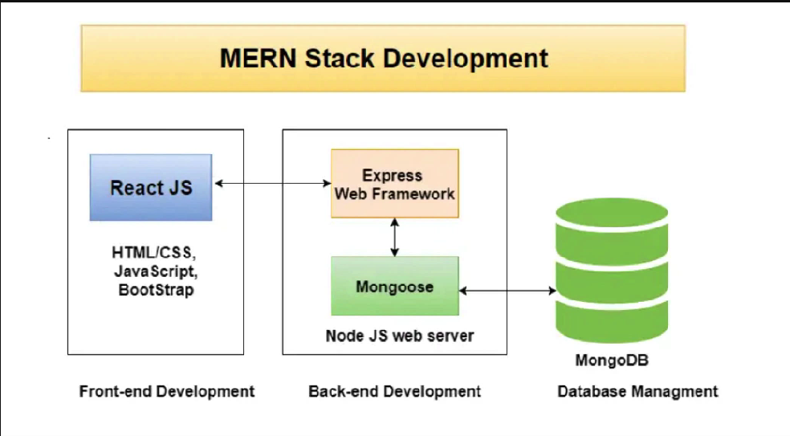 [~1]

- A MongoDB-t a Mongoose-on keresztül érjük el, ez egy Object Data Mapper sok könnyen használható függvénnyel, ami segít az adatbázishoz való csatlakozásban, és a műveletek elvégzésében, az Expressen keresztül.
- Felhasznált eszköz még a React frontendhez a Redux a Redux Toolkittel együtt, amely egy állapotkezelő, lehető teszi állapotok megjelenítését és kezelését.
- A Postman segítségével történt a backend tesztelése.

[1]: A kép a React Front to Back kurzusból származik

### 1. MongoDB beállítása

- MongoDB Atlas, a Mongo felhőalapú verziója
- Compass: letölthető eszköz a számítógépre, bármely operációs rendszerre, kapcsolatot biztosít az adatbázis eléréshez. Az alábbi képen látható a projektben létrehozott books adatbázis tartalma a Compass-en keresztül.

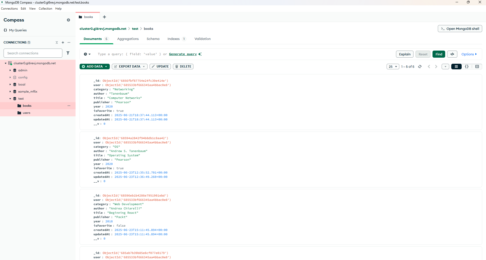

- A MongoDB-n létre kell hozni egy projektet és egy clustert, nekem az alapértelmezett maradt.

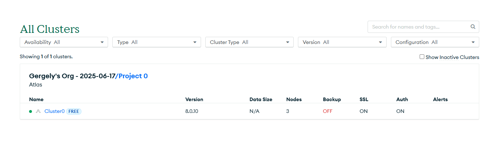

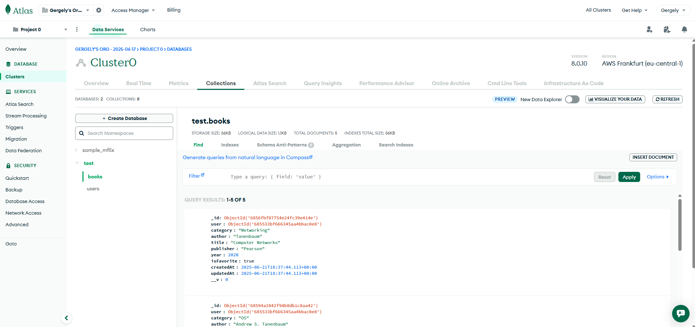

- A létrehozáskor különböző biztonsági beállításokat végezhetünk el. Felhasználónév és jelszó beállítása, ip cím beállítása, stb. (az ip címet 0.0.0.0-ra állítottam, hogy mindenhonnan elérhető legyen az adatbázis).
- Az Overview fülre kattintva a Clusteren belül csatlakoztathatjuk a backendhez (MongoDB shellen keresztül, az applikáción keresztül, és használhatunk MongoDB Compasst az itteni beállításoknál. Nekem a Compass sokkal szimpatikusabb volt a tesztelésnél, mert a mongodb.com oldalán viszonylag bonyolult elnavigálni az adatbázis megjelenítéséhez, a Compassnál ez csak néhány kattintás, bár a Postman önmagában is elegendő, ott is látható egy get kéréssel).

### 2. A szerverfájl-struktúra létrehozása

1. Létrehoztam egy backend mappát, azon belül a server.js-t.
2. Az npm init parancs segítségével létrehozom a package.json fájlt, amely a függőségeket és projektinformációkat, és konfigurációs beállításokat tartalmaz. Ilyen például a "scripts" részben, amely megmutatja az `npm run` paracsot milyen lehetőségekkel egészíthetjük ki, és mi történik. A kész backen package.json-ja a következő

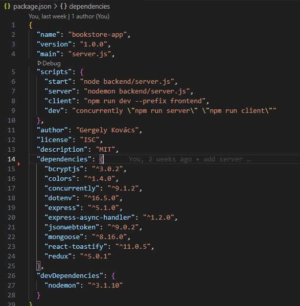

4. A következő lépés a .gitignore fájl létrehozása és kapcsolódás a githez. A .gitignore fájlhoz már ekkor hozzáadtam a node_modulest, kizárva a GitHubra való feltöltendő fájlok közül.
5. Npm package-ek hozzáadása: a `npm install express dotenv mongoose colors bcryptjs` parancs futtatásával a felsorolt eszközöket telepítettem (a dotenv készít egy különálló konfigurációs fájlt, a colors a konzolüzenetek színezéséhez van, a bcrypts pedig a jelszavak hash értékének előállításához kell).
6. Felhasználtam még a nodemont is, amely a változtatásokat követően automatikusan újraindítja a szervert, így nem kell kézzel elvégezni.

### 3. Alap Express szerver beállítások

1. Az Express szerver inicializálása: `const express = require('express');` segítségével (ez a korábbi szintaxis, használható helyette az import segítségével is, de akkor a package.json-ben a "type" beállítását "module"-ra kell állítani).
2. A port beállítása: a .env fájlon keresztül éri el (5000-es port)

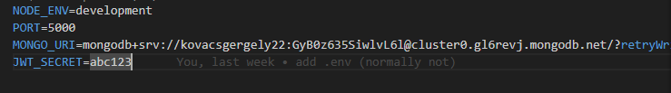

3. A kezdeti beállítások elvégzése után teszt a Postammel: A válasz 200-as, tehát minden rendben ment, látható a beállított json formátumú üzenet.

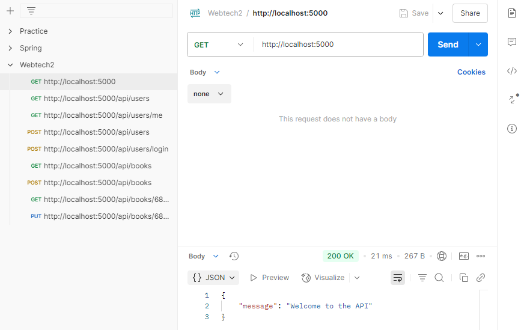

### 4. Útvonalak és vezérlő hozzáadása

1. A backenden belül a routes mappa létrehozása, azon belül a userRoutes.js.
2. A user utak létrehozása a get és post requestek segítségével
3. A controllers mappa létrehozása és a userController.js fájl benne. Itt szerepelnek a user utak function-jei, amelyeket a userRoutes.js felhasznál. Ehhez - mint minden hasonló esetben - a function-öket exportálni kell a kódjukat tartalmazó fájlból, és át kell adni a fájl elején (import vagy const változó segítségével), ahol azt felhasználjuk.

### 5. Hiba- és kivételkezelés

1. Az első middleware, vagyis köztes réteg, amit használunk, az express.json. Ez teszi lehetővé, hogy json formátumban küldjük az információkat. A másik, a body parser middleware, amely az átadott url kód elemzésére való, kinyeri az adatokat a bodyból. Régebben ezt külön dependency-ként kellett használnunk, már tartalmazza az express. A userController.js-ben van megadva milyen adatokat vár a bodyból.
2. Ellenőrzések végrahajtása a bejelentkezéssel és a regisztrációval kapcsolatban. Mivel ezek hibát dobhatnak, 
3. Hibakezelő middleware létrehozása a middleware mappában errorMiddleware néven. Ezt több helyen is alkalmazzuk később. ErrorHandler function létrehozása és exportálása, átadása a server.js-nek.
4. Express Async Handler telepítése, mert a regisztrációs és bejelentkezési függvényekben a Mongoose-t használjuk, egyik lehetőség ennek az alkalmazása. Az asyncHandler az aszinkron útvonalakon belüli kivételeket kezeli, és átadja azokat az Express kezelőnek. Ha nem használjuk az asyncHandlert,akkor a dokumentációban látható módon a .then függvényt kell használni, async await estében pedig try catch blokkot.  A dokumentációja elérhető: https://www.npmjs.com/package/express-async-handler

### 6. Csatlakozás az adatbázishoz

1. A MongoDB clusternél a connect gombra kattintva, majd a connect your application lehetőséget választva csatlakozhatunk (létrehoz egy karakterláncot, ami minden információt tartalmaz, ez a .env fájlban látható).
2. A backend mappán belül a config mappa létrehozása, abban a db.js fájl, ez lesz az adatbázis-kapcsolati fájl. Azon belül a connectDB function létrehozása és exportálása (az itt megjelenő konzolüzeneteket színezzük a korábban telepített `colors` segítségével).
3. Ezt követően a mongodb.com a clusterbeállításoknál a Network Access beállításainál megadhatjuk a szerver IP címét ("ADD CURRENT IP ADRESS" gomb segítségével), amelyről csatlakozni lehet az adatbázishoz (a 0.0.0.0 beállítással, vagy az "ALLOW ACCES FROM ANYWHERE" gombra kattintással bármely IP címről lehet csatlakozni).
4. A server.js-ben a connectDB functiont.

### 7. Felhasználó regisztrálása

1. A backend mappában létre kell hozni a models mappát, és a userModel.js fájlt. Ebben hozzuk létre az entitásunk sémáját (adattagjai felsorolása, ellenőrzés beállítása, alapértékek beállítása, unique elemek beállítása, és ellátjuk időbélyeggel `timestamps: true,`). A modell nevének beállítása és exportálás.
2. A userController.js-ben felhasználjuk a bcryptet, amellyel hashelni tudjuk a jelszót (plain text jelszót nem helyezhetünk el adatbázisban).
3. Felhasználjuk a modelt, jelen esetben a "User"-t. Ellenőrzések végrehajtása (például a regisztráció esetén, hogy létezik-e már az adott e-mail címmel felhasználó)
4. A hash password megjegyzéssel ellátott rész a userControlleren belül hajtja végre a jelszó hash-értékének előállítását a bcrypt segítségével, és salt, vagyis só hásználatával amit a hash-elés végrehajtása előtt adunk a jelszóhoz. A genSalt metódus hajtja ezt végre, a hozzá tartozó szám a kívánt körök számát jelenti, a dokumentáció szerint 10 a javaslat. A Create User megjegyzéssel ellátott felhasználót létrehozó create functionben a jelszót `hashedPassword`, vagyis titkosított formában mentjük.

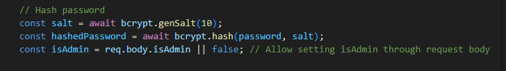

5. A létrehozott felhasználóval vissza kell adnunk egy tokent, és egy id-t is. Fontos, hogy a MongoDB az id-t a következő módon tárolja: _id. Fontos az alsóvonás jel.

### 8. Bejelentkezés és JWT létrehozása

1. A loginUser function megvalósítása, a felhasználó létezésének és a tárolt jelszavával való egyezés ellenőrzése. Mivel a jelszó hash formában van tárolva, az összehasonlítást is így kell elvégezni. 
2. Ha minden egyezik, hozzáadunk a felhasználóhoz egy tokent a generateToken felhasználásával, amivel telepíteni kell a json webtoken package-t az NPM-ből.

```
npm i jsonwebtoken
```

A generateToken megvalósítása:

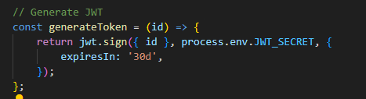

3. A JSON Webtokenhez szükség van egy secret-re is, aminek az értéke bármi lehet. Ezt szintén a .env fájlból nyeri ki a function. Az expiresIn segítségével a token lejáríti idejét állíthatjuk be, itt 30 nap (30d).
4. A fentiek elvégzése után így néz ki egy tárolt felhasználó az adatbázisban:

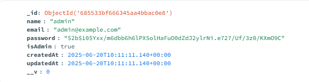

5. A Postmanben a helyes felhasználónév és jelszó megadásával a login oldalon (jelen esetben: http://localhost:5000/api/users/login) megjelenik a felhasználó tokenje is.

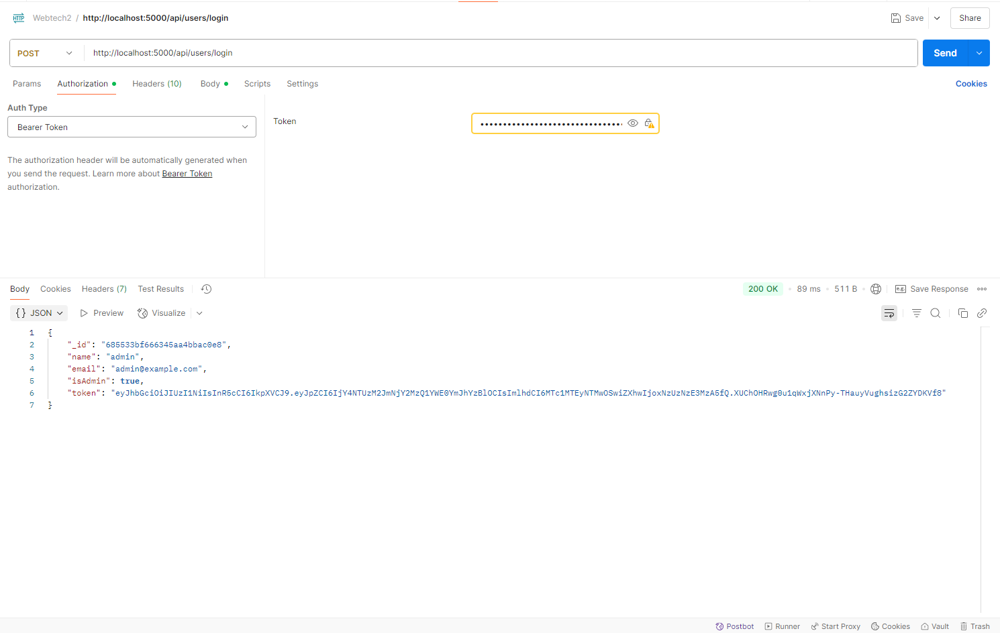

### 9. Útvonalak és hitelesítés védelme

1. A JSON webtoken tartalmaz felhasználói azonosítót és néhány adatot, ennek segítségével védjük le az utakat. A userRoutesban a következő kód hajtja ezt végre: `router.get('/me', protect, getMe);`
2. A userControllerben szerepel a getMe function kódja.

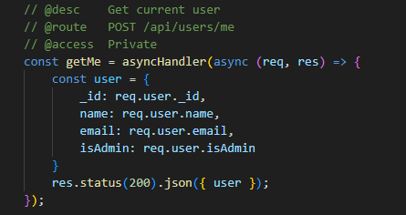

3. Middleware létrehozása az útvonal védelmére a middleware mappába authMiddleware.js néven. Itt a protect function megvalósítása. Ez megszerzi a tokent a headerből, ellenőrzi és megszerzi a segítségével a felhasználói adatokat. (A Postmanben való tesztelés során is megadhatjuk a tokent, az Authorization fülre kattintva a legördülő menüből ki kell választani a Bearer Tokent, és beilleszteni).

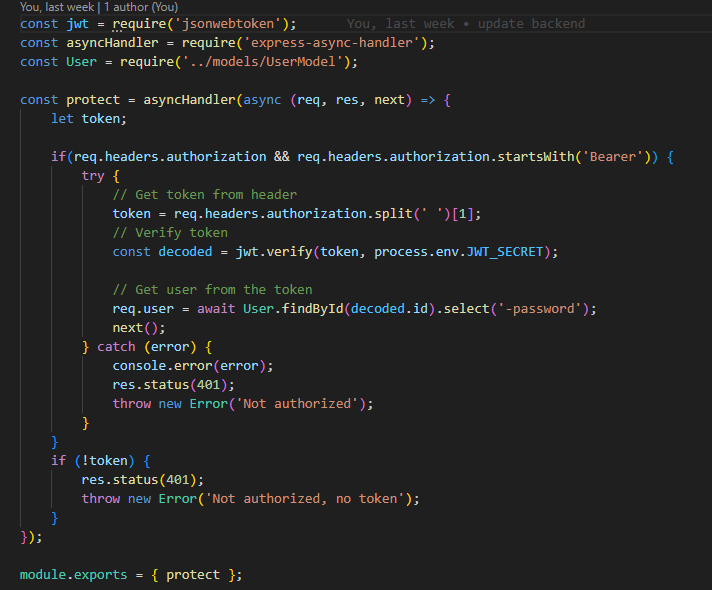

### Egyéb entitások hozzáadása

A későbbiekben a Book entitás, a Book objektumtípust adtam még hozzá, előbbi lépések végrehajtásával.

## Frontend

## 1. Create react app

- Az 

```
npx create react app@latest frontend --template redux
```

parancs segítségével hozza létre Brad Traversy a React Front to Back kurzusban a frontendet. Én ezzel hibákat tapasztaltam, előfordult, hogy nem jelenített meg semmit az oldal, az npm komoly sérülékenységekre hívta fel a figyelmet, és a redux esetében néhány fizetős package is előfordult. Ehelyett a Vite segítségével hoztam létre, ami sokkal stabilabb, és utólag adtam hozzá az npm-ből a redux-toolkitet.

```
npm create vite@latest my-react-app --template react
```

A telepítéskor a React frameworköt és a JavaScript variant-ot választottam.
Majd a frontend mappába lépve az `npm install` segítségével telepítettem a node modulokat.[~2]

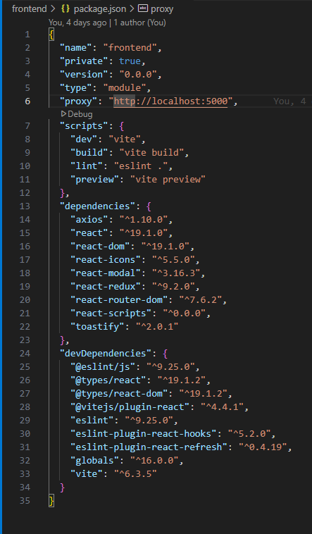

Emellett van még egy vite.config.js fájl is:

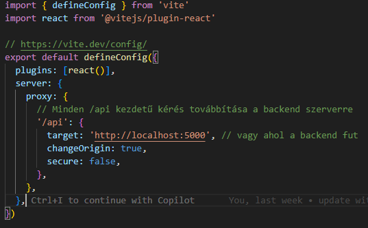

Ha a frontendben is szerepel egy .git mappa, akkor azt törölni kell, nincs rá szükség, mivel a backend létrehozásakor már megtörtént.

2. Előbbiekkel létrejön egy alapvető mappaszerkezet. Az én verziómban nem jött létre az src mappán belül app mappa és store.js, ezt létrehoztam és exportáltam, mert szükség lesz rá.
3. A későbbiekben szereplő css fájlokat én készítettem a copilot segítségével.

### Fejléc és kezdőlapok

1. A pages mappa létrehozása, Home.jsx, Login.jsx és Register.jsx létrehozása az src mappán belül.
2. Az App.jsx-ben a 

```
<Routes>
    <Route>
    </Route>
    <Route>
    </Route>
</Routes>
```

tagek között az utak létrehozása, tulajdonképpen az oldalak címeinek létrehozása.

A kész verzió a következő:

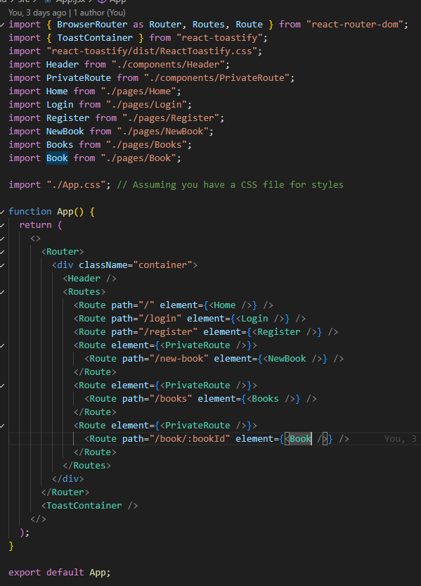

3. Header.jsx létrehozása az src mappán belül a components mappában, react ikonok használata. A kész verzió a következő:

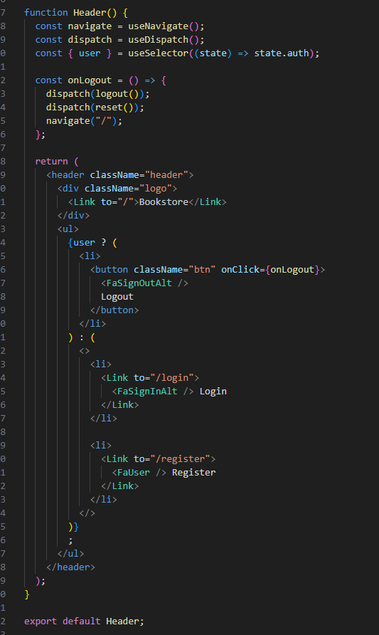

A következő importokra van szükség hozzá:

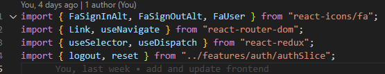

[2]: The Complete Full-Stack Web Development Bootcamp

### 2. Home, Login és Regisztrációs űrlapok létrehozása, felhasználói felület

1. A form létrehozása a Register.jsx-ben (a frontend/src/pages mappában található), a név, e-mail cím, jelszó, és jelszó megerősítése bekérésére. React ikonok és toast értesítések használata a react-toastify segítségével (a toastify működéséhez hozzá kell adni az App.jsx-hez a szükséges importokat és egy ToastContainert, lásd fentebb).
2. Az eredmény a következő:

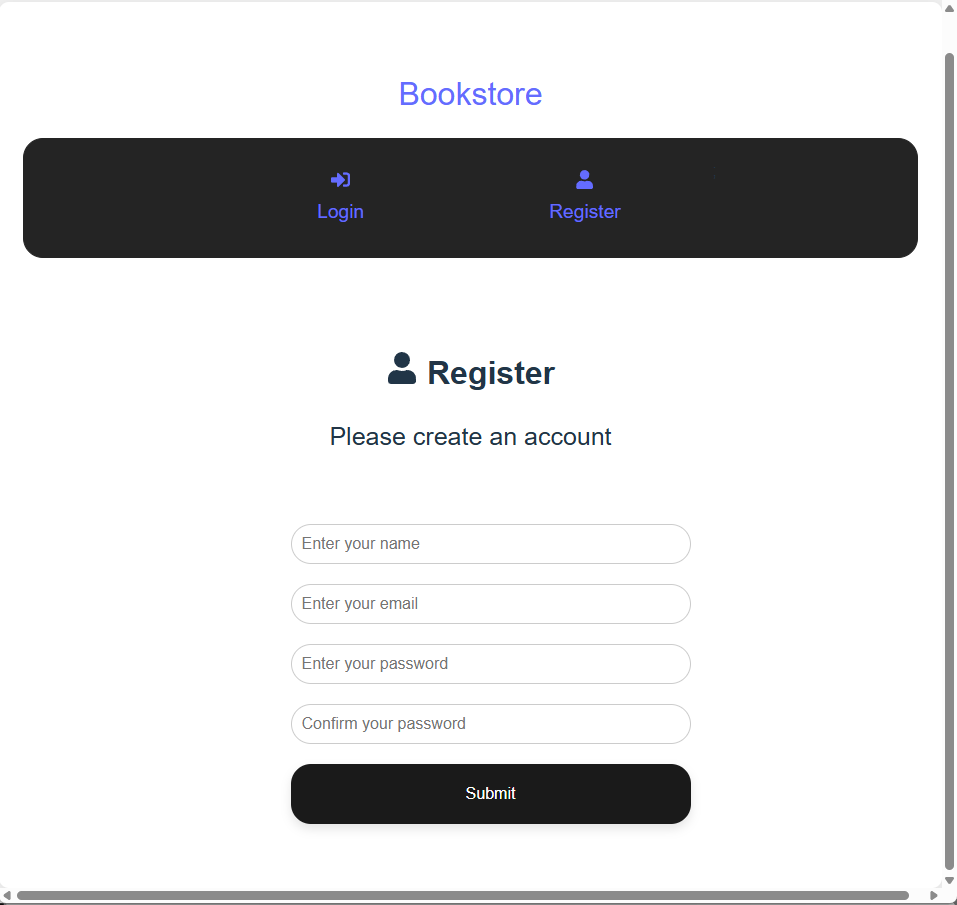

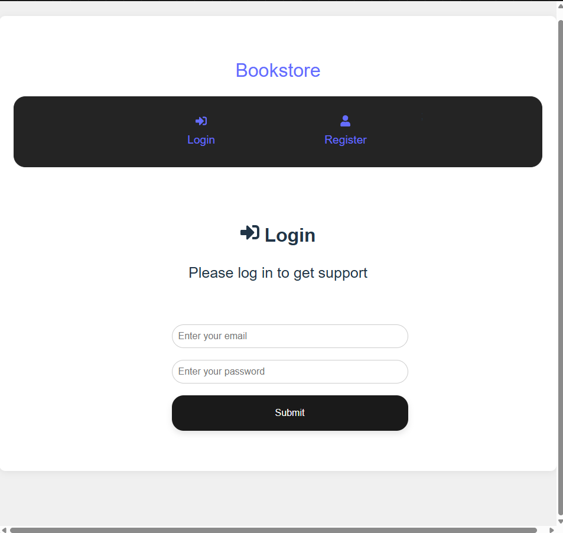

3. Home.jsx kódjának elkészítése, kiegészítése. 

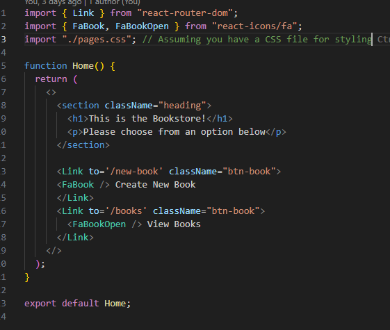

Az eredmény a következő:

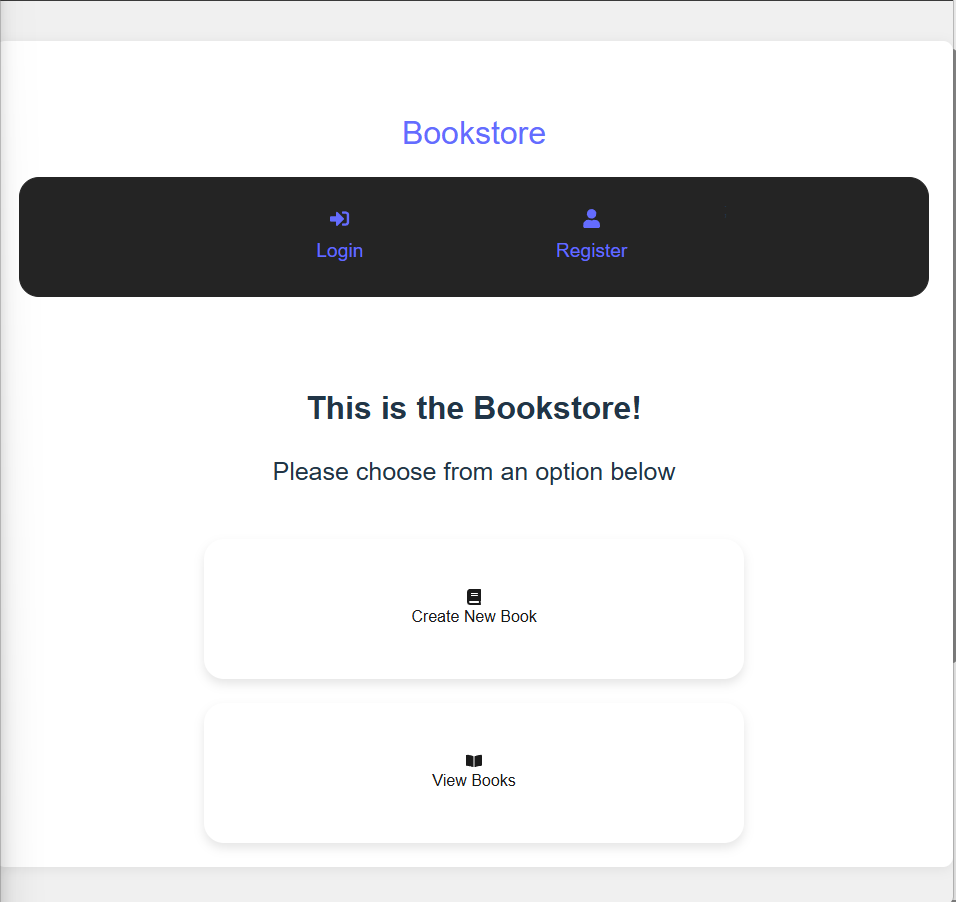

### 3. Redux beállítás és authSlice

1. Az  src/feauters/auth mappában létrehozom az authSlice.js és az authService.js fájlokat.
2. Az authSlice.js-ben a @reduxjs/toolkit-ből a createAsyncThunk. Ezzel az állapotokat tudjuk kezelni. Tartalmaz initialState-et. A reducers üres objektum lesz, az extraReducers olyan függvények, amelyek a builder különböző állapotait valósítják meg.
3. Az authSlice.js-ben a register function megvalósítása, összekapcsolása a Register.jsx-szel. Ehhez utóbbinál useSelector (a globális állapot bármely részét be tudja vinni egy komponensbe) és useDispatch importálására van szükség a react-redux könyvtárból és a register functionre az authSlice.js-ből.

### 4. Felhasználó regisztrálása, kijelentkezése és bejelentkezése

1. Az asyncThunk aszinkron módon működik, megkapja a user adatokat és a thunkAPI-t, és átadja azt authService.js-ben található register functionnek, amely továbbítja az axios importálávával az await axios.post segítségével a megfelelő url-re a userData néven mentett felhasználói adatokat.
2. Az állapotokat az authSlice-ban található extraReducerek kezelik.
3. A vite.config.js-ben és a frontendben található package.json-ban is be van állítva proxy, amely automatikusan a megadott url-re irányít anélkül, hogy mindenhova be kellene írni.


Látható, hogy a localhost:5000-es portra irányít, ahol a backend fut.
4. A bejelentkezés és kijelentkezés megvalósítása is az előbbi eszközökkel történik.

## A Book-kal kapcsolatos műveletek létrehozása

- A Book létrehozása a backendben, megjelenítése a frontendben az előbbiek felhasználásával történik. 
- A backendben az első részben lépések megismétlésével book modelt hozunk létre, összekapcsoljuk az adatbázissal, a felhasználóhoz kapcsoljuk.
- A bejelentkezést vagy regisztrációt követően elérhetők a felhasználóhoz kapcsolt könyvek, csak a saját könyvei. Nem bejelentkezett felhasználót a kezdőlapról a könyvek megjelenítése helyett átirányít a bejelentkezési felületre.
- Bejelentkezett felhasználó új könyvet vihet fel a NewBook.jsx formjának segítségével.
- Bejelentkezett felhasználó megtekintheti a könyveit. A gomb a Books.jsx oldalra visz, ami csak a cím alapján sorolja fel a könyveket, mind mellett egy View gombbal.
- A View gomb megjeleníti a könyv további részleteteit a Book.jsx oldalon keresztül. Itt található egy törlés gomb, ami a törlés funkciót valósítja meg egy delete requesten keresztül.
- A backendben megvalósítottam egy működő put requestet is.

## Felhasznált tananyag

- [React Front to Back 2022 [Video]](https://subscription.packtpub.com/video/web-development/9781838645274/p1/video1_1/welcome-to-the-course)
- [The Complete Full-Stack Web Development Bootcamp](https://www.udemy.com/course/the-complete-web-development-bootcamp/?couponCode=ST16MT230625B)